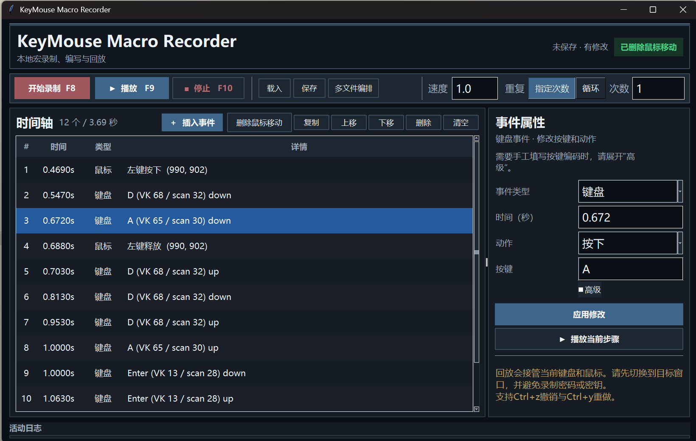

# KeyMouse Macro Recorder


[](LICENSE)
[](https://github.com/Farisland1625/key-mouse-macro-recorder/actions/workflows/ci.yml)

一个轻量、可编辑、可组合的 Windows 键鼠宏录制器。

KeyMouse Macro Recorder 不把录制结果当成不可修改的黑盒。每一次按键、鼠标移动、点击和滚轮操作都会进入可视时间轴：你可以检查事件、修改参数、调整顺序、直接插入新事件，也可以把多个宏文件按顺序和次数编排成一条新的自动化流程。

## 单个宏文件编辑：录制、修改与自行编写

- 选中任意事件，修改发生时间、动作类型和对应参数。
- 直接插入键盘按下/释放、鼠标移动、鼠标按钮按下/释放以及垂直或水平滚轮事件。
- 复制、删除、上移或下移事件，并用单步回放验证。
- 一键删除全部鼠标移动，只保留点击、滚轮和键盘操作在正确屏幕坐标。
- 支持 `Ctrl+Z` / `Ctrl+Y` 撤销和重做，分别保留最近 20 步编辑。

## 多文件编排：将短宏组合成完整流程

复杂操作不必录成一个难以维护的超长宏。你可以先保存多个短小、职责清晰的宏，再通过“多文件编排”生成新的标准宏文件：

- 按需要的顺序加入同一个或不同的宏文件。
- 为每个编排项设置独立播放次数。
- 上移、下移或删除编排项，并实时查看合成后的事件数与总时长。
- 在显示器布局不同的情况下，将源宏鼠标坐标映射到当前虚拟桌面。

## 高精度录制与回放

- 键盘和鼠标低级 Hook 运行在同一消息线程，并使用 Windows Hook 源时间戳，减少跨线程排序误差。
- 键盘事件保存虚拟键码、扫描码和扩展键状态；回放时优先使用扫描码。
- 保存录制时的虚拟桌面边界，并在显示器排列或尺寸变化时映射鼠标坐标。
- 支持 0.01x–20x 速度、指定次数或持续循环，以及播放中的暂停、继续和停止。

## 轻量部署 | Python 标准库 + Tkinter + Windows `ctypes`；打包 exe 约 11 MB |

## 界面预览



## 快速开始

### 从源码运行

要求 Windows 10/11 和 Python 3.10 或更高版本：

```powershell
git clone https://github.com/Farisland1625/key-mouse-macro-recorder.git
cd key-mouse-macro-recorder
python macro_recorder.py
```

Tkinter 通常随 Windows 版 Python 一起安装。程序运行时只使用 Python 标准库、Tkinter 和 Windows 原生 API，不需要安装第三方运行时包。

### 使用发布版

首个正式 GitHub Release 尚未发布。发布后可从仓库的 Releases 页面下载单文件 `KeyMouseMacroRecorder.exe`，无需安装 Python。

### 完成第一个可编辑宏

1. 按 `F8` 开始录制，再按一次 `F8` 停止。
2. 在时间轴中选择事件，检查或修改时间、动作和参数。
3. 使用“插入事件”补充遗漏步骤，或复制、移动、删除已有步骤。
4. 用“单步回放”验证选中的事件；确认后点击“保存”写入 JSON。
5. 选择回放速度和重复模式，按 `F9` 开始回放。
6. 回放中按 `F9` 暂停/继续，按 `F10` 停止录制或回放。

脱敏格式示例见 [`examples/basic_click.json`](examples/basic_click.json)。

### 编排多个宏

1. 先分别录制、编辑并保存需要复用的短宏。
2. 点击顶部的“多文件编排”。
3. 按执行顺序加入宏文件；同一文件可以加入多次。
4. 为每一项设置播放次数，并根据需要上移、下移或删除。
5. 保存编排结果。程序会生成新的 schema 2 宏文件，所有源文件保持不变。

## 宏文件格式与隐私

宏使用 `schema_version: 2` 的 JSON 格式，事件只包含 `key` 和 `mouse` 两类。每个事件的 `t` 是从宏开始计算的绝对秒数：

- 键盘事件包含 `vk`、`scan`、`action` 和 `extended`。
- 鼠标事件包含 `message`，并按动作需要包含 `x`、`y` 或 `data`。
- 文件保存使用唯一临时文件、`flush` / `fsync` 和原子替换，降低中断造成半文件的风险。
- 载入时严格校验 schema、时间、事件类型、坐标和编码，不静默接受损坏的数据。

宏可能包含完整的键盘输入、屏幕坐标和操作时序。不要录制密码、验证码、令牌、私钥或其他敏感信息，也不要把个人宏上传到 Issue、Pull Request 或公开仓库。

仓库中的 `macros/` 默认被整体忽略；`examples/` 只存放脱敏的最小示例。程序默认不联网，也不会主动上传宏内容。

## 安全边界

- 回放会控制当前鼠标和键盘。启动前请切换到正确的目标窗口，并确认程序与目标应用具有相同权限。
- `F8`、`F9`、`F10` 是全局控制键，请避免把它们作为宏流程中的普通按键。
- 不要运行来源不明的宏文件或他人提供的修改版 exe。
- 程序不会隐藏运行，也不以规避用户控制或系统安全机制为目标。
- 当前项目仅支持 Windows，仅在windows上进行过验证。
更多安全与漏洞报告说明见 [`SECURITY.md`](SECURITY.md)。

## 构建单文件 exe


```powershell
python -m venv .venv_user
.\.venv_user\Scripts\python.exe -m pip install -r requirements-dev.txt
powershell -ExecutionPolicy Bypass -File .\build_exe.ps1
```

输出为 `dist\KeyMouseMacroRecorder.exe`。`build/`、`dist/` 和虚拟环境均被 `.gitignore` 排除；建议通过 GitHub Releases 分发二进制，而不是把构建产物提交到源码历史。

## 开发与验证

```powershell
.\.venv_user\Scripts\python.exe -m unittest discover -s tests -v
.\.venv_user\Scripts\python.exe -m py_compile macro_recorder.py tests\test_macro_format.py
```

当前基线包含 41 项核心逻辑测试，并已验证 PyInstaller onefile 构建。GitHub Actions 会在 Push 和 Pull Request 中使用 Python 3.10 / 3.12 运行测试与语法检查，并在 Python 3.12 下验证 onefile 构建。

欢迎提交可复现的问题、精度案例、时间轴编辑建议和 UI 改进。贡献代码前请阅读 [`CONTRIBUTING.md`](CONTRIBUTING.md)；安全问题请按 [`SECURITY.md`](SECURITY.md) 私下报告。

## 项目结构

```text
macro_recorder.py          # Windows GUI、录制、编辑、回放和 JSON 格式
tests/                     # 无窗口核心逻辑测试
examples/                  # 脱敏示例宏
build_exe.ps1              # PyInstaller 构建脚本
KeyMouseMacroRecorder.spec # PyInstaller 配置
requirements-dev.txt       # 仅构建所需的开发依赖
```

## 许可证

本项目以 [MIT License](LICENSE) 发布。欢迎 Fork、提交 Issue 和 Pull Request，一起把一个小而可靠、真正可编辑的 Windows 宏工具做得更好。
